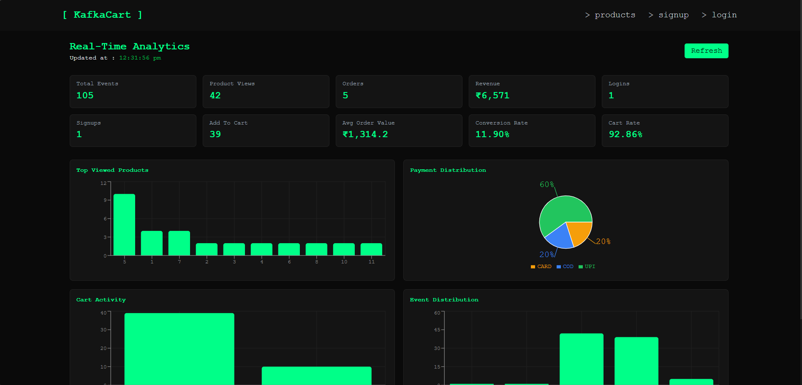
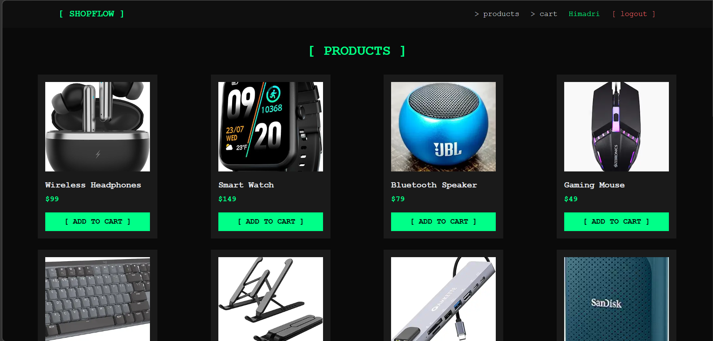
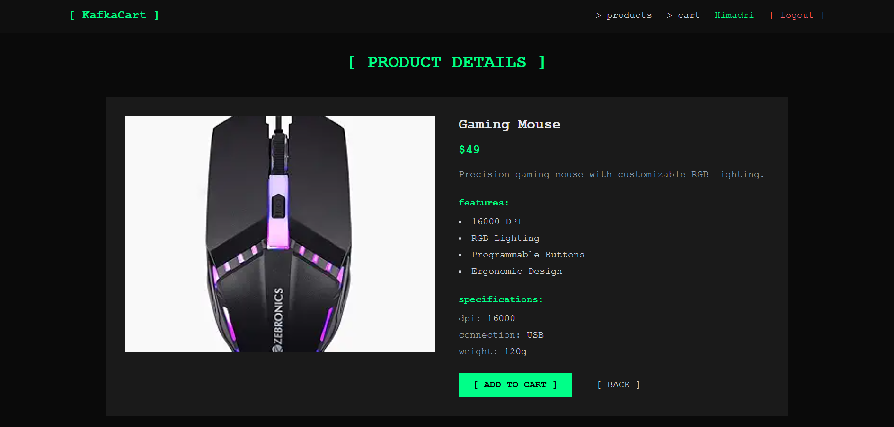
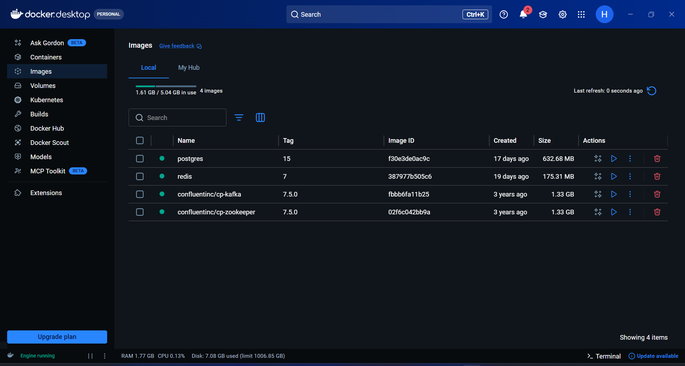

# KafkaCart - Real-Time Event Analytics for E-Commerce

<div align="center">

<table>
	<tr>
		<td></td>
		<td>
			<h1>KafkaCart</h1>
			<em>Stream Every Click, Learn Every Pattern</em>
		</td>
	</tr>
</table>

**A real-time event-driven e-commerce analytics platform built with React, Express, and Apache Kafka to track user behavior and visualize insights instantly.**

[](https://react.dev/)
[](https://expressjs.com/)
[](https://kafka.apache.org/)
[](https://www.postgresql.org/)
[](https://redis.io/)
[](https://www.docker.com/)


[Features](#-features) • [Tech Stack](#-tech-stack) • [Getting Started](#-getting-started) • [Architecture](#-architecture) • [Contributing](#-contributing)

</div>

---

## 📋 Overview

**KafkaCart** is a full-stack learning project that simulates an e-commerce flow and captures user interaction events in real time. The frontend emits structured events (login, product view, cart updates, checkout, and order placement), the backend publishes them to Kafka, and a consumer continuously aggregates analytics for dashboard visualization.

It is designed to help you understand practical event-driven architecture patterns, including producer-consumer flow, stream-based analytics, and near real-time dashboarding.

---

## 📸 **Project Screenshots**

<table width="100%">
	<tr>
		<td align="center" colspan="3">
			<br/>
			<b>Analytics Dashboard</b><br/>
			<sub>Real-time analytics showing events, conversions, top products, and payment distribution</sub>
		</td>
	</tr>
	<tr>
		<td align="center" width="33%">
			<br/>
			<b>Product Catalog</b><br/>
			<sub>Browse products while triggering product view and cart interaction events</sub>
		</td>
		<td align="center" width="33%">
			<br/>
			<b>Product Page</b><br/>
			<sub>Detailed product view with add-to-cart and interaction tracking</sub>
		</td>
		<td align="center" width="33%">
			<br/>
			<b>Docker Containers</b><br/>
			<sub>Containerized services running the full analytics platform</sub>
		</td>
	</tr>
</table>

---

## 🌟 Features

### Event Streaming Pipeline
- **Kafka Producer API** - Frontend sends events to Express, which publishes to Kafka topic `user-events`
- **Kafka Consumer Aggregation** - Continuous consumer updates in-memory analytics state in real time
- **Structured Event Schema** - Consistent payload shape across login, product, cart, and order workflows
- **Topic Partitioning Ready** - Topic setup supports multiple partitions for scaling experiments

### E-Commerce Event Tracking
- **Authentication Events** - `USER_LOGIN`, `USER_SIGNUP`, and `USER_LOGOUT`
- **Shopping Behavior Events** - `PRODUCT_VIEW`, `ADD_TO_CART`, `REMOVE_FROM_CART`
- **Checkout & Order Events** - `CHECKOUT_STARTED`, `PAYMENT_METHOD_SELECTED`, `ORDER_PLACED`
- **Metadata Support** - Tracks order totals, payment method, item counts, and product IDs

### Analytics API & Dashboard
- **Summary Metrics** - Total events, signups, logins, orders, revenue, and average order value
- **Top Product Insights** - Most viewed products from event stream aggregation
- **Cart Funnel Metrics** - Add-to-cart vs remove-from-cart behavior
- **Payment Distribution** - Event-based payment method usage stats

### Developer Experience
- **Dockerized Infra** - Kafka, Zookeeper, Postgres, and Redis via Docker Compose
- **Modern Frontend Stack** - React + Vite + Tailwind + Recharts for responsive visualization
- **Simple Local Setup** - Minimal commands to run full streaming pipeline locally
- **Learning-Friendly Codebase** - Clear separation of producer, consumer, and analytics endpoints

---

## 🎯 Use Cases

- **Kafka Learning Projects** - Understand real-time producer-consumer workflows end to end
- **Event-Driven Architecture Demos** - Show asynchronous analytics pipeline in interviews and demos
- **Behavior Analytics Prototyping** - Rapidly test which user actions should be tracked and how
- **Dashboarding Practice** - Build real-time metrics views from streaming event sources
- **System Design Exploration** - Experiment with partitions, consumer groups, and scale paths

---

## 🛠 Tech Stack

### Frontend
| Technology | Purpose |
|------------|---------|
| **React 19** | Component-based UI for e-commerce pages and analytics dashboard |
| **React Router** | Client-side navigation between login, products, cart, checkout, and analytics |
| **Tailwind CSS** | Utility-first styling for responsive interface |
| **Recharts** | Data visualization for summary, funnel, and distribution charts |
| **Vite** | Fast development server and frontend build tool |

### Backend
| Technology | Purpose |
|------------|---------|
| **Node.js** | JavaScript runtime for API and consumer logic |
| **Express.js** | REST API for event ingestion and analytics endpoints |
| **KafkaJS** | Kafka client for producer and consumer operations |
| **CORS** | Cross-origin configuration for frontend-backend communication |

### Infrastructure
| Technology | Purpose |
|------------|---------|
| **Apache Kafka** | Durable event stream for user behavior tracking |
| **Zookeeper** | Kafka coordination service (local development setup) |
| **PostgreSQL** | Ready-to-use relational datastore for future persistence expansion |
| **Redis** | Ready-to-use in-memory store/cache for future optimization |
| **Docker Compose** | Multi-service orchestration for local environment |

---

## 🏗 Architecture

```
React Client
      │
      ▼
Express API
      │
      ▼
Kafka Producer
      │
      ▼
Kafka Topic: user-events
      │
      ▼
Kafka Consumer
      │
      ▼
Real-Time Aggregator
      │
      ├── Analytics API
      │
      ├── Redis Cache
      │
      └── PostgreSQL (future persistence)
```

---

## 🚀 Getting Started

### Prerequisites

Make sure you have the following installed:
- **Node.js** (v18 or higher recommended)
- **npm**
- **Docker Desktop** (for Kafka/Zookeeper/Postgres/Redis)

### Installation

1. **Clone the repository**
	 ```bash
	 git clone https://github.com/himadri75/KafkaCart.git
	 cd "KafkaCart"
	 ```

2. **Start infrastructure services**
	 ```bash
	 docker compose up -d
	 ```

3. **Setup Backend**
	 ```bash
	 cd server
	 npm install
	 ```

4. **Create Kafka topic (one-time or when needed)**
	 ```bash
	 node createTopic.js
	 ```

5. **Setup Frontend**
	 ```bash
	 cd ../client
	 npm install
	 ```

### Running the Application

1. **Start the Backend Server**
	 ```bash
	 cd server
	 npm start
	 ```
	 Server will run on `http://localhost:3000`

2. **Start the Frontend Development Server**
	 ```bash
	 cd client
	 npm run dev
	 ```
	 Frontend will run on `http://localhost:5173`

3. **Open analytics dashboard**
	 Navigate to your analytics route `http://localhost:5173/analytics` in the frontend app to view live data updates. 

### Event Schema

```json
{
	"eventId": "uuid",
	"eventType": "EVENT_NAME",
	"userId": "USER_ID",
	"sessionId": "SESSION_ID",
	"productId": "PRODUCT_ID",
	"timestamp": 1710432000,
	"source": "web",
	"metadata": {}
}
```

### Available Analytics Endpoints

- `GET /analytics/summary`
- `GET /analytics/top-products`
- `GET /analytics/cart`
- `GET /analytics/payments`

---

## 👨‍💻 Developer Profile

**Himadri Karan**  
*Full Stack Developer & Software Engineer*

- 📧 **Email**: [Karanhimadri1234@gmail.com](mailto:Karanhimadri1234@gmail.com)
- 💼 **LinkedIn**: [linkedin.com/in/himadri516](https://www.linkedin.com/in/himadri516/)  
- 🌐 **Portfolio**: [Himadri.me](https://himadri.me)
- 🐙 **GitHub**: [github.com/himadri75](https://github.com/himadri75)  

---

<div align="center">

**Built to explore real-time event streaming with Apache Kafka and modern web technologies.**

If this project helped you, consider giving it a ⭐

</div>
